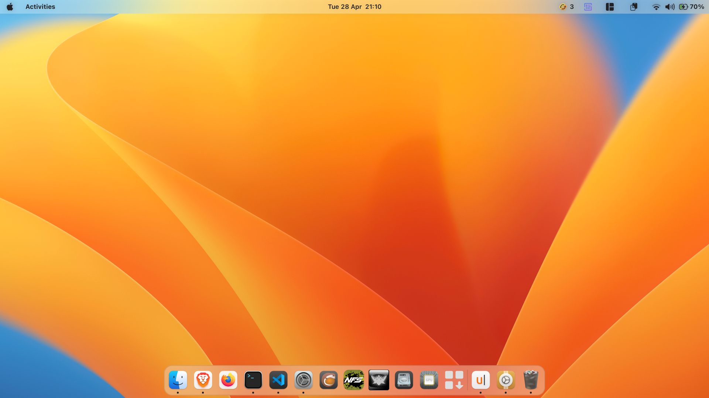
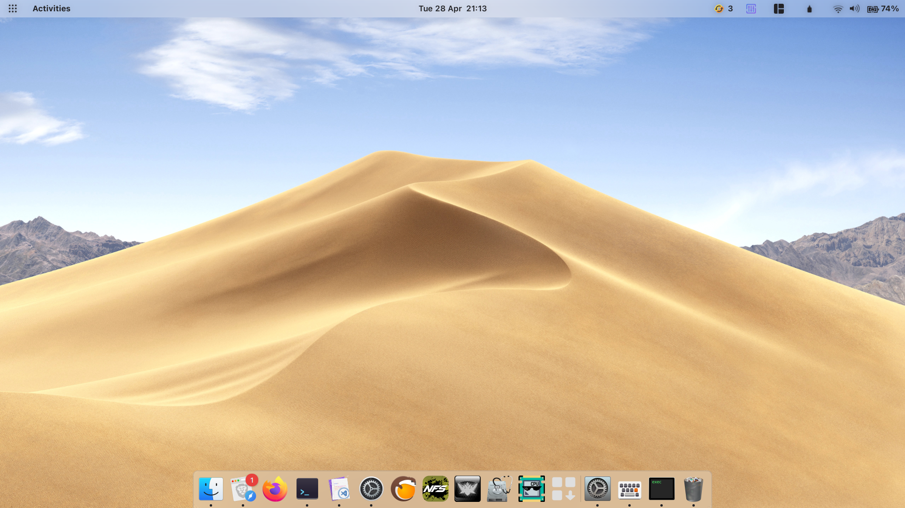

# WACK – Cupertino Lite Dock

A stripped down, and currently maintained lightweight fork, of **[Dash Cupertinisator](github.com/rinzler69-wastaken/dash-cupertinisator)**.

<p align="center">
  
  
</p>

This is a part of the WACK project (WACK Ain't Cupertino, Kid), a collection of tweaks aimed at bringing a refined, macOS-inspired aesthetic to the GNOME desktop.

This specific extension focuses on the Dock, with macOS-inspired theming (Mojave and Big Sur styles) and bounce animations for launching and urgent apps, as well as a quality-of-life improvement for smoother Magic Lamp minimize effects.

## Features
- **macOS-inspired Theming** <br>
Choose from two dock themes — Mojave (flush to screen edge, 10px radius) and Big Sur (floating, 22px radius) — in light, dark, or system-synced color. Includes macOS-style notification badge styling. Theming can be toggled off under Theme → Override Theming.
- **macOS-inspired Launch Animation** <br>
App icons bounce when launching or urgent, with tunable speed and bounce height.
- **Magic Lamp Integration** <br>
One-click patcher for the **[Compiz-alike Magic Lamp Effect](https://github.com/hermes83/compiz-alike-magic-lamp-effect)** that fixes two rough edges: windows no longer slip beneath the dock gap when minimizing, and bilinear filtering smooths out the effect's jagged edges.

## Best Used With
This extension is a companion to **[Dash to Dock](https://github.com/micheleg/dash-to-dock/)** — install it first for this extension to work. 


## Install / update (one-step Makefile)

```bash
git clone https://github.com/rinzler69-wastaken/cupertino-dock-lite.git
cd cupertino-dock-lite
make            # copies into ~/.local/share/gnome-shell/extensions/cupertino-dock-lite@rinzler69-wastaken.github.com
```

Then reload GNOME Shell (`Alt+F2` → `r` on Xorg; logout/login on Wayland) and enable:

```bash
gnome-extensions enable cupertino-dock-lite@rinzler69-wastaken.github.com
```


## Compatibility
- Developed and tested on GNOME 49 (Fedora), support for GNOME 48 through GNOME 45 should most likely be fine. More issues are yet to be known since tests are yet to be made for other configurations. Feel free to open an issue if bugs are found, or clone and contribute!

## About the WACK Project
- WACK (WACK Ain't Cupertino, Kid) brings the best design patterns and details from macOS to the GNOME Desktop — dock magnification, traffic-light window controls, lockscreen layout, quick settings layouts, and many more to come — built entirely within what GNOME already gives you.
